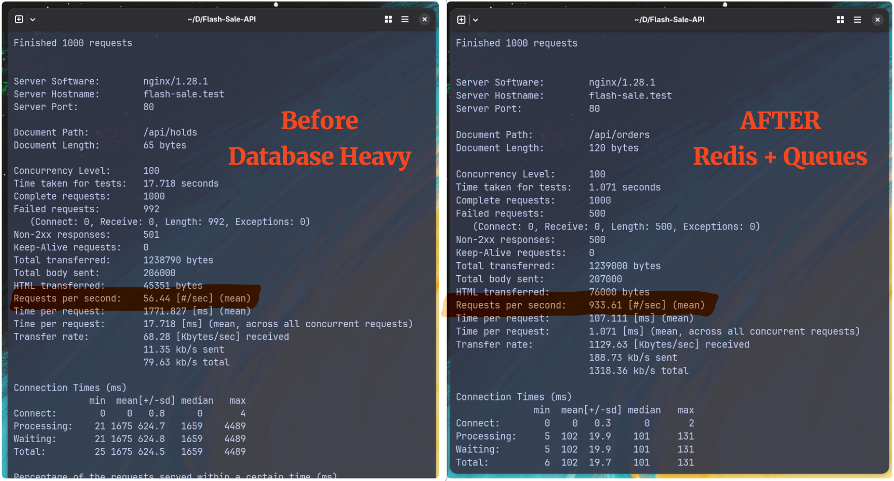
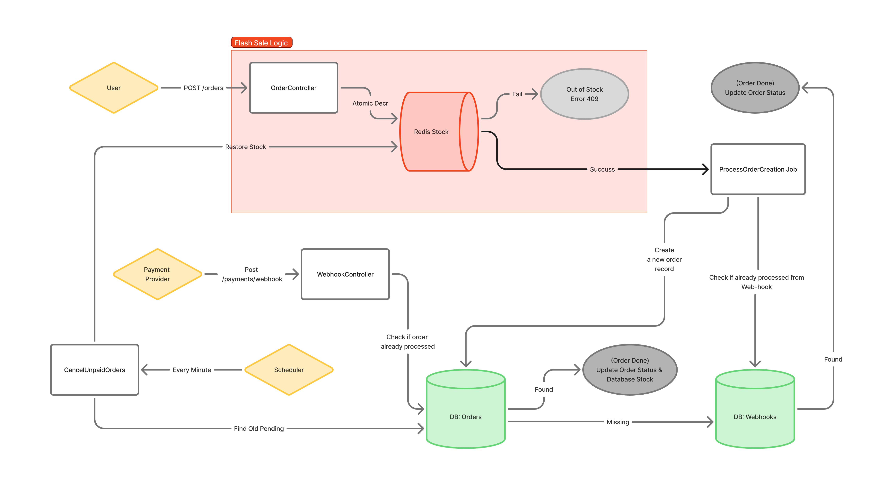
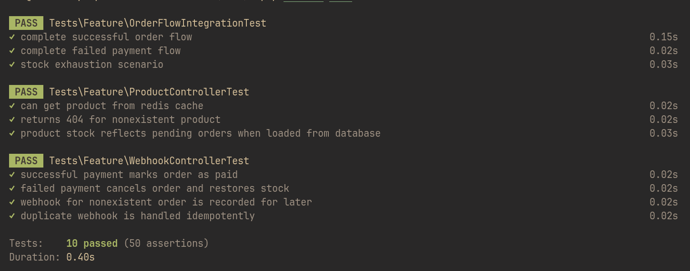

# Flash Sale API Experiment
A flash-sale backend that prevents oversells under extreme load by making Redis the fast, atomic source-of-truth for inventory and offloading durable work to background queues. Designed to show how to safely accept bursts of concurrent orders while keeping the database protected, maintainable, and auditable.

## Used
PHP 8.5 · Laravel 12 · PostgreSQL · Redis · PHPUnit · Shell scripts (ab/joined clients)

## API Endpoints

| Method | Endpoint | Description |
|--------|----------|-------------|
| `GET` | `/api/products/{id}` | Get product details |
| `POST` | `/api/orders` | Make order request |
| `POST` | `/api/payments/webhook` | Handle payment webhook |

## This project went through two main phases:

### Phase 1: Synchronous Database Architecture (Legacy)
The initial version relied heavily on direct database interactions with pessimistic locking. While this ensured strong data consistency, it introduced a significant bottleneck during high-traffic bursts. Each request tied up a database connection, and sequential row locking meant that requests queued up, leading to high latency and reduced throughput (`~56 req/sec`). 

This approach is available in the `before-redis-queues` branch.

### Phase 2: Asynchronous Redis & Queue Architecture (Current)
To solve the concurrency bottleneck, the system was refactored to decouple **stock reservation** from **order persistence**.
- During the flash sale window, Redis is the temporary source of truth for inventory.
- PostgreSQL becomes the source of truth after payment confirmation.
- Redis stock is reconciled back to the database through background jobs and webhook finalization.
- Queues process the "heavy" database writes in the background.

## Benchmarks
A side-by-side comparison using `Apache Benchmark (ab)` demonstrating the impact of refactoring a synchronous database-heavy architecture to an asynchronous model using Redis and Queues.

Key Results:

- Requests per second (RPS) jumped from `56.44` to `933.61`, representing a `16.5x` improvement.
- Average time per request dropped from `1771ms` to `107ms`.
- The total time required to process 1000 concurrent requests decreased from `17.71` seconds to `1.07` seconds.



Benchmarks were run locally on a single application instance on nginx with Redis and PostgreSQL running locally.


## Product Purchase Flow
The flow diagram illustrates the asynchronous logic:



- Incoming `POST /orders` requests hit the `OrderController`, which attempts an atomic decrement on a Redis Stock key. 
- If the atomic operation is successful, a `ProcessOrderCreation` Job is dispatched to the queue to persist the order in the Orders table.
- If Redis stock reaches zero, the system immediately returns a 409 Conflict error without hitting the database.
- Reconciliation Orders:
   -  Runs a `CancelUnpaidOrders` task every minute to find old pending orders and restore the stock in Redis.
   - The `WebhookController` listens for payment provider updates to finalize order status in the database.

## Failure Scenarios & Guarantees

| Scenario | Handling / Guarantee |
| :--- | :--- |
| **Redis Crash** | If Redis keys are evicted or the service restarts, `RedisStockService` automatically rebuilds the stock cache from the database on the next request (Lazily), ensuring high availability. |
| **Worker Failure** | If the queue worker crashes while processing an order, Laravel's queue retries ensure the final consistency of the system. |
| **Race Conditions (Early Webhook)** | If a payment webhook arrives before the order is created in the database (due to async lag), the system records the webhook as `pending`. When the order job finally runs, it checks for this pending webhook and immediately updates the status to 'paid' or 'cancelled'. |
| **Overselling Protection** | Redis Lua scripts ensure that stock decrements are strictly atomic. Even with 1000 concurrent requests, it is impossible for the stock counter to drop below zero. |
| **Stale Reservations** | If a user reserves stock but never pays, the `orders:release` scheduled command (running every minute) cancels the order and restores the inventory to Redis. |

## Running and Testing the Application

### Clone the repo
```bash
git clone https://github.com/r6mez/Flash-Sale-Task
cd Flash-Sale-Task
```

### Environment Varibles
Copy `.env.example` into a `.env` file, and change postgres configurations to meet yours.

### Setup
Create a database called `flash_sale_api` or whatever name you put in the `.env` file then run

```
composer setup
```

### Database Seeding
```bash
php artisan db:seed
```
- this will add 2 products to the db.

### Sync Stock to Redis
```bash
php artisan app:sync-stock-to-redis
```
- this will sync the stock of products from db to redis, run before running the server.

### Development Server
```bash
composer dev
```

This runs concurrently:
- Laravel server at `http://localhost:8000`
- Queue worker for canceling expired orders as a background job.

### Running Tests
directly with PHPUnit (for sequential tests):
```bash
php artisan test
```



### Run The Benchmarks
First, create a JSON file named `order_data.json` with the following content:

```json
{
  "product_id": 1,
  "qty": 2,
}
```

Then, run the following command:
```shell
ab -n 1000 -c 100 -p ~/order_data.json -T application/json -k http://flash-sale.test/api/orders
```

- for the older version without redis and queues, checkout the branch `before-redis-queues`

If you find this project useful, a star is appreciated.